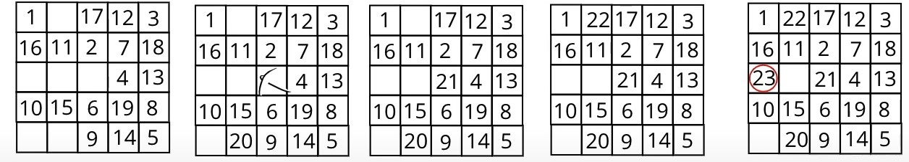
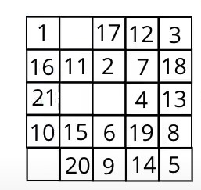
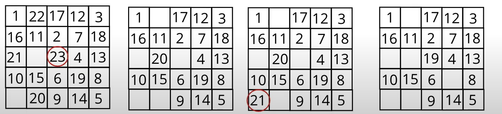
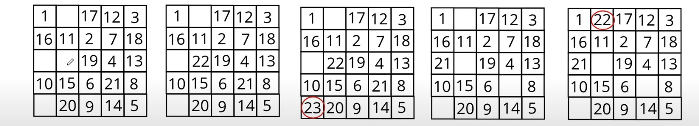
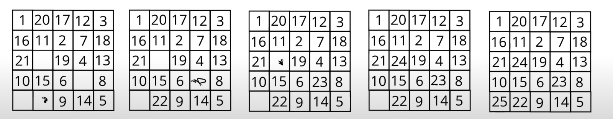

# PROIECT SINCRETIC
### METODE AVANSATE DE PROGRAMARE

**Nume proiect: Circuit Cal in C**

**Nume student: Oprisor Andreea-Agripina**

**Descriere:**
##### Am implementat o solutie pentru problema "Circuitului Calului" pe o tabla de sah de dimensiune N x N folosind limbajul de programare C. Acest proiect rezolva enigma gasirii unei secvente de mutari ale calului care acopera fiecare celula a tablei o singura data, respectand regulile de saritura a calului.

Sursa*poza*tutorialepenet*

### REZOLVARE MATEMATICA:
#### Algoritmul mereu va lua prima solutie, iar solutia va fi luata in oridinea acelor de ceasornic, conform imaginii de mai sus, fiindca asa am precizat in cod prin secventa de directii.

#### Totul de aici se intampla in mod normal pana in pozitiile 19-23. In momentul in care se ocupa pozitia 23, se observa ca orice mutare pe care urmeaza sa o faca este indisponibila.

#### Acest fapt duce la o intervenire de cod unde inducem faptul ca programul trebuie sa dea 3 mutari inapoi pentru a alege o alta pozitie pentru mutarea 20.

#### Si tot asa se vor da inapoi mutarile in mai multe randuri de la pozitia in care se blocheaza, pentru a incerca alte posibilati favorabile conditiei de a nu ocupa aceesi pozitie de 2 ori.

#### In momentul in care se ajunge la pozitia 25, ciclul se incheie si tabla este completa cu mutari nereptate, ajung altfel la solutia 41.

## PENTRU PARTEA DE COD:
##### Avem doar 7 coordonate initiale care dau solutie pentru cazul in care calul sa ocupe toate pozitiile tablei si anume:(0,0),(1,0),(2,0),(0,1),(1,1),(2,2),(7,7). Restul sunt coordonate invalide care nu vor da solutie programului.

## CODUL SURSA ACTUALIZAT:
###### Codul functioneaza pentru dimensiunea tablei 8x8 si afiseaza doar o singura solutie pentru coordonatele initiale (0,0), deja introduse in cod.